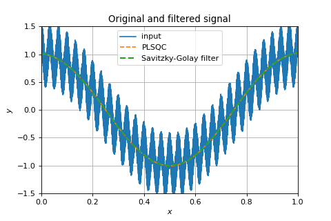
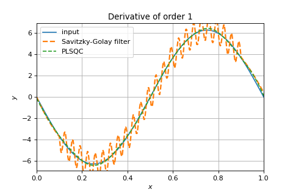
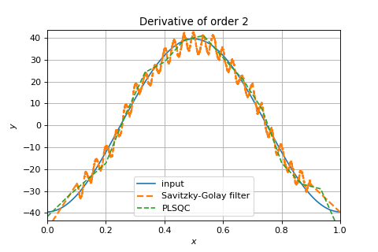

# **P**iecewise-polynomial **L**east-**SQ**uare fit with **C**ontinuity constraints
*(PLSQC)*

This Python package provides the PLSQC class which, given an input 1D array corresponding to a sampled signal, can compute a filtered signal and its derivatives.
The algorithm is based on the splitting of the overall sampled time interval in multiple windows of equal durations. On each window, a least-square polynomial fit of a chosen degree (default is 3) is computed. Continuity constraints (by default up to degree-1) can be applied to enforce to the continuity of the fit and its successive derivatives. The algorithm is compatible with a nonuniform sampling grid.

## Tutorial
The main script itself contains the below example.
Upon instantiation of the class, the constrained least-square fit is computed.
```python
# instantiate and solve the LSQC problem
obj = PLSQC(x=x, y=y, T=T, continuity=2, deg=3)
```
The obtained object can then be used to evaluate the fit and its derivatives
```python
# Evaluate the filtered signal on the new grid xi
 filtered_signal = obj(xi)
 # Evaluate the filtered second-derivative
 filtered_derivative = obj(xi, der=2)
```

Here is a comparison of the PLSQC result and the Savitzki-Golay filter from Scipy on a simple test case :






Improvements for the future:
* ~~Faster linear solution with sparse matrices.~~
* Enable custom breakpoints to be specified instead of uniform window length. Each breakpoint should have a specified continuity constraint.
* Add the ability to integrate the piecewise-polynomial fit.
